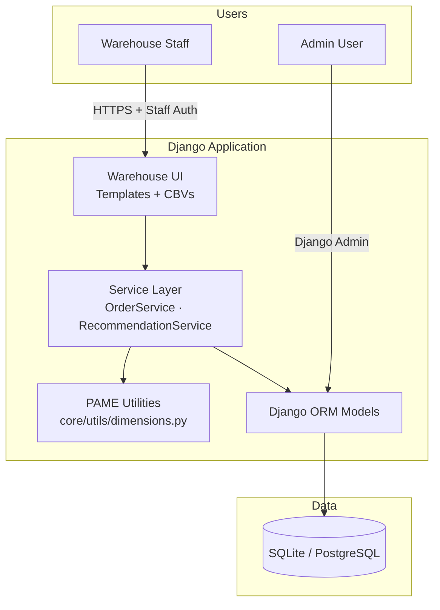
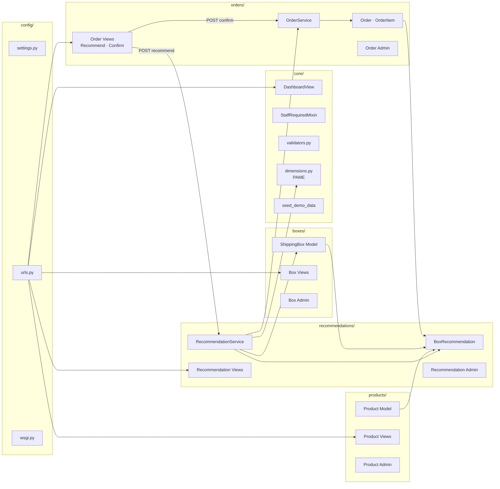
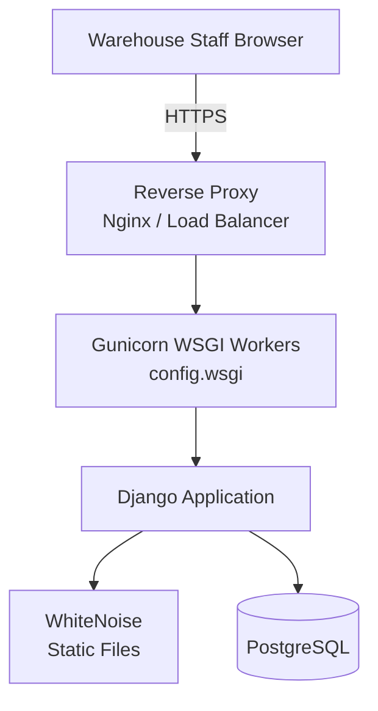
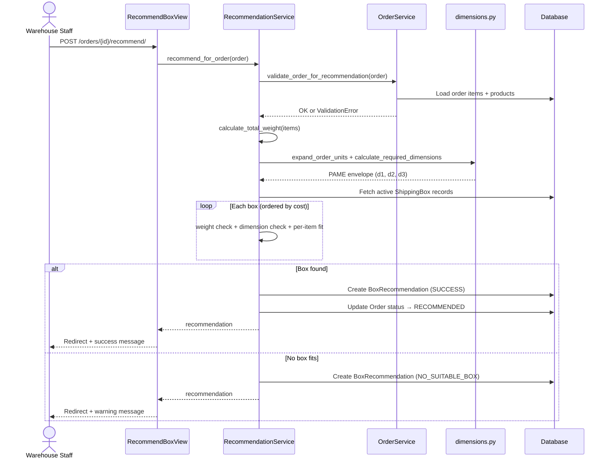
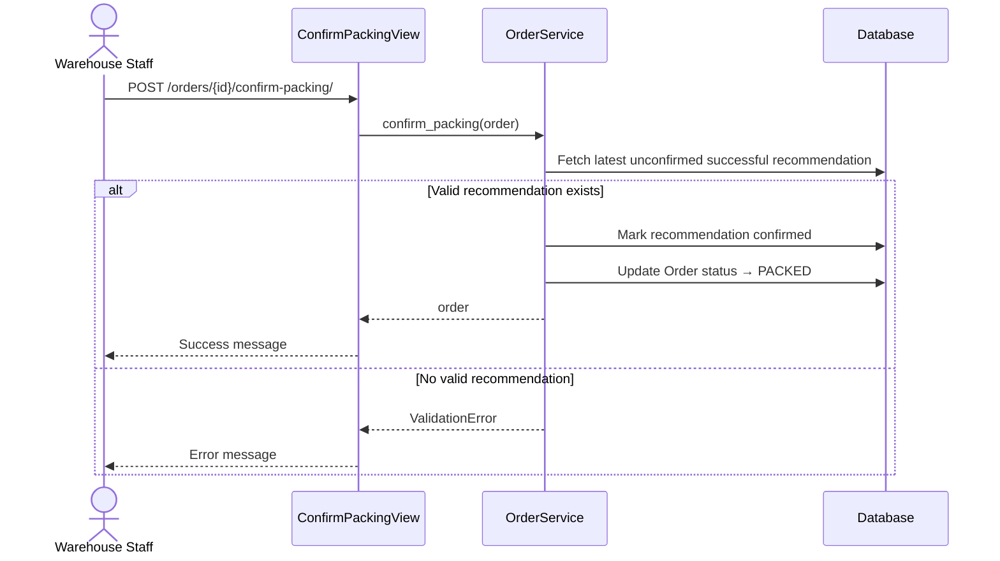
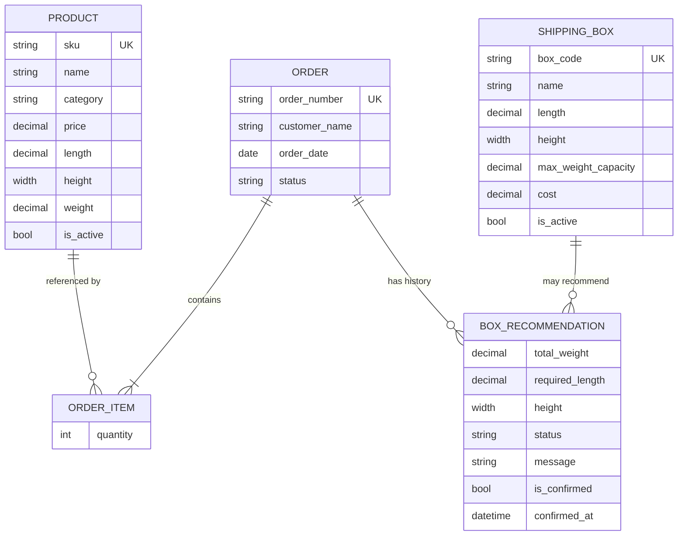

# Architecture Documentation
## Smart Box Recommendation System for WareNexa Warehouse Suite

**Company:** WareNexa Technologies Pvt. Ltd.  
**Project:** Smart Box Recommendation System  
**Client context:** TechNest Electronics  
**Version:** 1.0  
**Document type:** Solution Architecture  
**Audience:** Engineering reviewers, internship evaluators, operations stakeholders  

---

## Table of Contents

1. [High-Level Architecture](#1-high-level-architecture)
2. [Layered Architecture](#2-layered-architecture)
3. [Component Diagram](#3-component-diagram)
4. [Deployment Architecture](#4-deployment-architecture)
5. [Data Flow](#5-data-flow)
6. [Module Responsibilities](#6-module-responsibilities)
7. [Design Decisions](#7-design-decisions)
8. [Why a Service Layer Was Used](#8-why-a-service-layer-was-used)
9. [Why PAME Was Chosen Over 3D Bin Packing](#9-why-pame-was-chosen-over-3d-bin-packing)
10. [Trade-offs](#10-trade-offs)
11. [Scalability Considerations](#11-scalability-considerations)
12. [Future Enhancements](#12-future-enhancements)

---

## 1. High-Level Architecture

The Smart Box Recommendation System is a **server-rendered Django web application** for WareNexa Warehouse Suite that supports warehouse staff in selecting the most cost-effective shipping carton for an order. It is a **backend operational module**, not a customer-facing e-commerce platform.

At the highest level, the system consists of four cooperating areas:

| Area | Role |
|------|------|
| **Warehouse UI** | Bootstrap 5 templates for dashboard, catalog browsing, order packing workflow |
| **Business services** | Order validation, packing confirmation, box recommendation engine |
| **Persistence layer** | Django ORM models for products, boxes, orders, and recommendation history |
| **Data store** | SQLite (development) or PostgreSQL (production) |



### System boundaries

**In scope**
- Product and shipping box master data
- Warehouse order management
- Automated box recommendation (PAME algorithm)
- Recommendation audit history
- Packing confirmation workflow

**Out of scope**
- Shopping cart, checkout, payments
- Customer authentication
- Inventory management, dispatch logistics, courier integration

---

## 2. Layered Architecture

The project follows a **strict layered (n-tier) architecture** within a monolithic Django deployment. Each layer has a single responsibility and may only call the layer directly beneath it.

```
┌─────────────────────────────────────────────────────────────┐
│  PRESENTATION LAYER                                         │
│  Django Templates · Class-Based Views · URL routing           │
│  StaffRequiredMixin · Messages framework                      │
└────────────────────────────┬────────────────────────────────┘
                             │ delegates to
┌────────────────────────────▼────────────────────────────────┐
│  BUSINESS SERVICE LAYER                                       │
│  OrderService          RecommendationService                  │
│  (validation, packing) (orchestration, box selection)         │
└────────────────────────────┬────────────────────────────────┘
                             │ uses
┌────────────────────────────▼────────────────────────────────┐
│  DOMAIN / UTILITY LAYER                                       │
│  PAME dimension calculations · Shared validators              │
└────────────────────────────┬────────────────────────────────┘
                             │ persists via
┌────────────────────────────▼────────────────────────────────┐
│  ORM / DATA ACCESS LAYER                                      │
│  Product · ShippingBox · Order · OrderItem · BoxRecommendation│
└────────────────────────────┬────────────────────────────────┘
                             │
┌────────────────────────────▼────────────────────────────────┐
│  DATABASE                                                     │
│  SQLite (dev) · PostgreSQL (prod)                             │
└─────────────────────────────────────────────────────────────┘
```

### Layer rules enforced in code

| Rule | Enforcement |
|------|----------------|
| No business logic in views | Views only call services and handle HTTP concerns |
| No recommendation logic in models | Models define structure and field validation only |
| No packing algorithm in templates | Templates display service output |
| Algorithm isolated in utilities | `core/utils/dimensions.py` owns PAME math |

---

## 3. Component Diagram



### Component interaction summary

| Component | Collaborators | Responsibility |
|-----------|---------------|----------------|
| `RecommendBoxView` | `RecommendationService` | HTTP trigger for recommendation |
| `ConfirmPackingView` | `OrderService` | HTTP trigger for packing confirmation |
| `RecommendationService` | `OrderService`, `dimensions.py`, `ShippingBox` | Full recommendation workflow |
| `OrderService` | `Order`, `BoxRecommendation` | Order eligibility and packing rules |
| `dimensions.py` | Pure Python / Decimal | PAME envelope and rotation-aware fit checks |

---

## 4. Deployment Architecture

### Development environment

```
Developer Workstation
├── Python 3.10+
├── Django development server (manage.py runserver)
├── SQLite database file (db.sqlite3)
└── Local static files (static/)
```

### Production environment (recommended)



### Production configuration highlights

| Concern | Implementation |
|---------|----------------|
| Application server | Gunicorn (`gunicorn config.wsgi:application`) |
| Static assets | WhiteNoise + `collectstatic` → `staticfiles/` |
| Database | PostgreSQL via `POSTGRES_*` environment variables |
| Secrets | `DJANGO_SECRET_KEY` required when `DEBUG=False` |
| HTTPS | `SECURE_SSL_REDIRECT`, secure cookies, optional HSTS |
| CSRF | `CSRF_TRUSTED_ORIGINS` for proxied HTTPS domains |
| Authentication | Django session auth; staff-only warehouse views |
| Logging | Structured console logging (`orders`, `recommendations` loggers) |

### Environment variable contract

See `.env.example` for the full list. Critical production variables:

- `DJANGO_SECRET_KEY`
- `DJANGO_DEBUG=False`
- `DJANGO_ALLOWED_HOSTS`
- `DJANGO_CSRF_TRUSTED_ORIGINS`
- `POSTGRES_DB`, `POSTGRES_USER`, `POSTGRES_PASSWORD`, `POSTGRES_HOST`, `POSTGRES_PORT`

---

## 5. Data Flow

### 5.1 Box recommendation workflow (primary use case)



### 5.2 Packing confirmation workflow



### 5.3 Entity relationship (data model)



---

## 6. Module Responsibilities

### 6.1 Django project (`config/`)

| Artifact | Responsibility |
|----------|----------------|
| `settings.py` | Application configuration, database, security, logging, static files |
| `urls.py` | Root URL routing, admin, authentication, app includes |
| `wsgi.py` | WSGI entry point for Gunicorn |

### 6.2 `core/`

| Artifact | Responsibility |
|----------|----------------|
| `views.py` | Warehouse Operations Dashboard with operational metrics |
| `mixins.py` | `StaffRequiredMixin` for access control |
| `validators.py` | Reusable decimal validators (positive, non-negative) |
| `models.py` | `ValidatedModel` abstract base (runs `full_clean()` on save) |
| `utils/dimensions.py` | PAME algorithm and rotation-aware fit utilities |
| `management/commands/seed_demo_data.py` | Demo catalog and sample orders loader |

### 6.3 `products/`

| Artifact | Responsibility |
|----------|----------------|
| `models.py` | Product master data (SKU, dimensions, weight, price) |
| `views.py` | Read-only product list and detail pages |
| `admin.py` | Product CRUD for administrators |

### 6.4 `boxes/`

| Artifact | Responsibility |
|----------|----------------|
| `models.py` | Shipping box catalog (dimensions, capacity, cost) |
| `views.py` | Read-only box list and detail pages |
| `admin.py` | Box CRUD for administrators |

### 6.5 `orders/`

| Artifact | Responsibility |
|----------|----------------|
| `models.py` | `Order`, `OrderItem`, `OrderStatus` lifecycle |
| `services/order_service.py` | Order validation and packing confirmation |
| `views.py` | Order list/detail, recommend and confirm POST endpoints |

### 6.6 `recommendations/`

| Artifact | Responsibility |
|----------|----------------|
| `models.py` | `BoxRecommendation` audit records |
| `services/recommendation_service.py` | Recommendation engine orchestration |
| `views.py` | Recommendation history list and detail |

### 6.7 `templates/`

Shared Bootstrap 5 layout, warehouse pages, staff login, error pages, and pagination partials.

---

## 7. Design Decisions

| Decision | Choice | Rationale |
|----------|--------|-----------|
| Framework | Django 4.2 LTS | Mature ORM, admin, auth, suitable for monolithic WMS modules |
| UI approach | Server-rendered templates | Simple deployment, no separate frontend build pipeline |
| App decomposition | Domain-driven Django apps | Clear ownership: products, boxes, orders, recommendations |
| Business logic location | Dedicated service classes | Testability, thin views, single place for workflow rules |
| Packing algorithm location | `core/utils/dimensions.py` | Pure functions, no Django coupling, easy unit testing |
| Algorithm | PAME | Balances realism and simplicity for academic/production-demo scope |
| Box selection policy | Lowest cost among valid boxes | Matches business requirement to minimize packaging cost |
| Database (dev) | SQLite | Zero-config local development |
| Database (prod) | PostgreSQL | Production-grade relational store, env-driven switch |
| Auth model | Django staff users | Warehouse operators are internal; no customer accounts |
| Recommendation history | Append-only records | Audit trail for every recommendation run |
| Validation strategy | Field validators + `ValidatedModel.save()` | Prevents invalid master data at persistence time |
| Static files (prod) | WhiteNoise | Simplified deployment without separate static server |

---

## 8. Why a Service Layer Was Used

### Problem without services

If recommendation logic lived in views or models:

- **Views** would become large, untestable, and coupled to HTTP
- **Models** would mix persistence with packing algorithms (violating SRP)
- **Changes** to business rules would require touching UI code
- **Unit tests** would require Django request/response machinery

### Benefits delivered by `OrderService` and `RecommendationService`

| Benefit | Example in this project |
|---------|-------------------------|
| **Single Responsibility** | `RecommendationService` owns the 8-step recommendation workflow |
| **Testability** | 36 unit/integration tests call services directly without HTTP |
| **Reusability** | Same service callable from admin actions, management commands, or future APIs |
| **Transaction boundaries** | `@transaction.atomic` applied at service level for consistent writes |
| **Readable views** | `RecommendBoxView.post()` is ~15 lines: call service, show message, redirect |
| **Stable contract** | Views depend on service interface, not internal algorithm steps |

### Illustration

```
❌ Anti-pattern:  View → ORM + algorithm + status updates + messages
✅ This project:  View → RecommendationService → utilities + ORM
```

The service layer acts as the **application boundary** between user interface and domain/persistence, which is a standard pattern in enterprise Django applications.

---

## 9. Why PAME Was Chosen Over 3D Bin Packing

### The underlying problem

Given multiple rectangular items and a set of available cartons, find the **cheapest box** such that:

1. Every item fits (with rotation allowed)
2. Total weight ≤ box capacity
3. All items can be physically packed together

The general form of this problem is **3D bin packing**, which is **NP-hard**. Exact solvers are computationally expensive and complex to implement, validate, and maintain.

### Approaches considered

| Approach | Description | Outcome |
|----------|-------------|---------|
| **Stacking sum** | Sum longest dimensions of all items | Too conservative; rejected after analysis |
| **PAME** | Per-axis maximum of sorted dimensions | **Selected** |
| **Volume-based** | Total volume × packing factor | Ignores shape; unreliable alone |
| **Full 3D bin packing** | Exact/heuristic placement | Overkill for project scope |

### PAME definition

For each unit, sort dimensions: **d₁ ≤ d₂ ≤ d₃**

```
required_d1 = max(d1) across all units
required_d2 = max(d2) across all units
required_d3 = max(d3) across all units
```

A box qualifies if:

1. Sorted box dimensions ≥ required envelope
2. Each unit passes rotation-aware individual fit check
3. Total weight ≤ capacity

### Why PAME was selected

| Criterion | PAME | 3D Bin Packing |
|-----------|------|----------------|
| Implementation complexity | Low (~80 lines) | High (heuristics, placement state) |
| Determinism | Fully deterministic | Depends on heuristic ordering |
| Testability | Simple table-driven tests | Complex scenario matrices |
| Performance | O(boxes × units) | Potentially exponential / heavy CPU |
| Fit for catalog | Matches consumer electronics orders (dominant item + accessories) | Better for heterogeneous freight |
| Internship clarity | Easy to explain and document | Difficult to justify without OR library |

### Documented assumption

PAME assumes **smaller items pack into void space** within the largest item's bounding prism—a common simplification in introductory warehouse management systems and acceptable for TechNest's product mix (mice, keyboards, monitors, etc.).

---

## 10. Trade-offs

### 10.1 Architectural trade-offs

| Trade-off | Chosen | Sacrificed | Acceptable because |
|-----------|--------|------------|-------------------|
| Monolith vs microservices | Monolith | Independent scaling of modules | Single warehouse module, small team |
| Server templates vs SPA | Templates | Rich client interactivity | Operational CRUD workflow is form-driven |
| Append-only recommendations vs overwrite | History table | Storage over time | Audit requirement for warehouse ops |

### 10.2 Algorithm trade-offs (PAME)

| Advantage | Limitation |
|-----------|------------|
| Fast, predictable | May underestimate when two large items need separate floor space |
| Aligns with demo order expectations | Not a guarantee of physical packability in all cases |
| Cheapest valid box selection | No padding/clearance tolerance for packing material |
| Per-item rotation check adds safety | No “fragile” or “this side up” orientation rules |

### 10.3 Security trade-offs

| Decision | Trade-off |
|----------|-----------|
| Staff-only auth (not per-role permissions) | Simpler; all staff share same capabilities |
| Session-based auth | Simpler than JWT; requires sticky sessions or shared session store at scale |
| CDN-hosted Bootstrap | Fast setup; optional hardening with SRI or self-hosting |

---

## 11. Scalability Considerations

### Current capacity profile

The system is optimized for **small-to-medium warehouse operations**:

- ~15–1,000 products
- ~6–50 box types
- Hundreds of orders per day
- Single-region deployment

### Scaling dimensions

| Dimension | Current state | Scale path |
|-----------|---------------|------------|
| **Web tier** | Single Gunicorn process | Horizontal replicas behind load balancer |
| **Database** | Single PostgreSQL instance | Read replicas, connection pooling (`CONN_MAX_AGE`) |
| **Recommendation CPU** | In-request synchronous | Background task queue (Celery) for bulk re-runs |
| **Box catalog query** | Full scan of active boxes | Cache active box list in Redis if catalog grows |
| **Recommendation history** | Unbounded append | Archival job, partitioning by `created_at` |
| **Static assets** | WhiteNoise | Offload to CDN in multi-region deployments |
| **Auth sessions** | Database/cache sessions | Centralized session store for multi-node |

### Performance practices already in place

- `select_related` / `prefetch_related` on list and detail views
- Database indexes on SKU, box code, status, category
- Box iteration ordered by cost (early exit on first match)
- Lightweight PAME calculations (no external solver)

### Bottleneck assessment

For the TechNest demo catalog, **recommendation latency is sub-millisecond** excluding database I/O. The primary scaling concern at higher volume is **database write rate** on recommendation history, not algorithm CPU.

---

## 12. Future Enhancements

The following extensions are compatible with the frozen architecture and do not require redesign:

### 12.1 Algorithm and domain

| Enhancement | Description |
|-------------|-------------|
| Packing clearance rule | Require 1–2 cm tolerance per dimension for void fill |
| Item orientation flags | `must_stay_upright` on fragile products |
| Multi-box orders | Split line items across cartons when single box insufficient |
| Volumetric weight | Courier billing rules alongside cost minimization |
| Heuristic 3D packing | Optional advanced mode behind feature flag |

### 12.2 Workflow

| Enhancement | Description |
|-------------|-------------|
| `DISPATCHED` status transition | Service method + admin action when order leaves warehouse |
| Manual box override | Staff selects different box with reason code |
| Barcode scanning | Mobile UI for SKU verification during packing |
| Recommendation expiry | Re-recommend if catalog changes after N hours |

### 12.3 Technical

| Enhancement | Description |
|-------------|-------------|
| REST API | DRF endpoints reusing existing services |
| Role-based permissions | Packer vs supervisor vs catalog manager |
| Event bus | Emit `OrderPacked` events to the WareNexa Warehouse Suite platform |
| Observability | Prometheus metrics, structured JSON logging, Sentry |
| CI/CD pipeline | GitHub Actions with lint, test, coverage gates |

### 12.4 Integration (WareNexa Warehouse Suite platform)

| Enhancement | Description |
|-------------|-------------|
| Order import API | Receive orders from omnichannel commerce core |
| Catalog sync | Nightly product dimension updates from PIM |
| Shipping label service | Push confirmed box size to courier integration |

---

## Appendix A — Technology Stack

| Layer | Technology |
|-------|------------|
| Language | Python 3.10+ |
| Framework | Django 4.2 LTS |
| ORM | Django ORM |
| Database | SQLite (dev), PostgreSQL (prod) |
| Frontend | Django Templates, Bootstrap 5 |
| WSGI server | Gunicorn |
| Static files | WhiteNoise |
| Auth | Django.contrib.auth (staff sessions) |

## Appendix B — Key source locations

| Concern | Path |
|---------|------|
| PAME algorithm | `core/utils/dimensions.py` |
| Recommendation engine | `recommendations/services/recommendation_service.py` |
| Order workflow | `orders/services/order_service.py` |
| Access control | `core/mixins.py` |
| Configuration | `config/settings.py` |
| Demo data | `core/management/commands/seed_demo_data.py` |

## Appendix C — Test strategy

| Layer | Test modules |
|-------|--------------|
| PAME utilities | `core/tests/test_dimensions.py` |
| Validators | `core/tests/test_validators.py` |
| Models | `products/tests/`, `boxes/tests/`, `orders/tests/` |
| Services | `recommendations/tests/`, `orders/tests/test_order_service.py` |
| Demo regression | `recommendations/tests/test_pame_demo_orders.py` |
| HTTP workflow | `orders/tests/test_views.py` |

**Total:** 36 automated tests covering algorithm, services, models, and critical view paths.

---

*Document prepared for internship / academic submission. Describes the implemented system as of project version 1.0. No implementation changes are implied by this document.*
