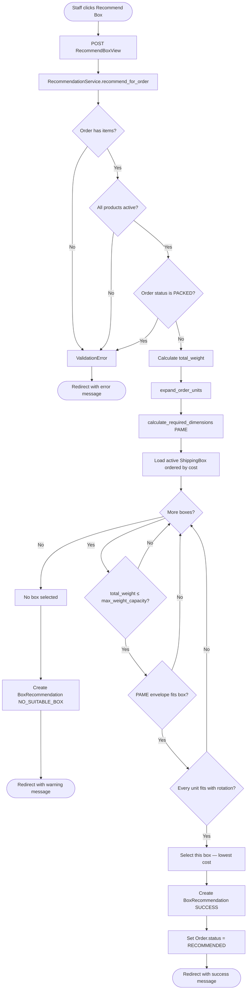
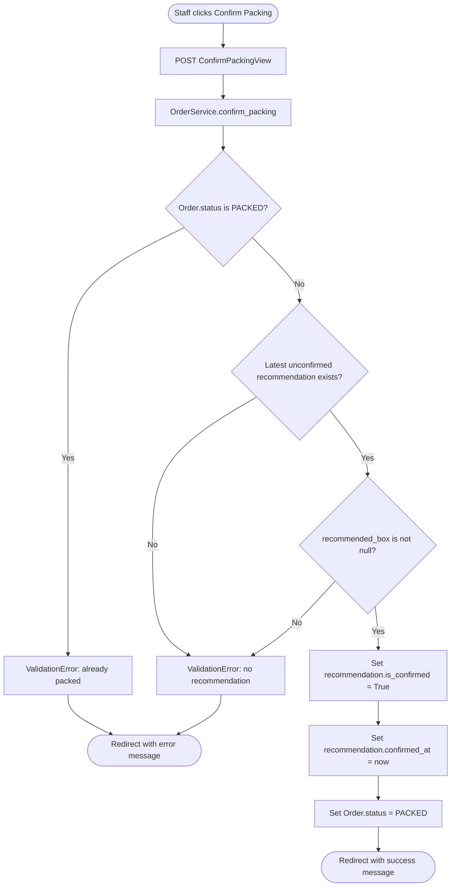
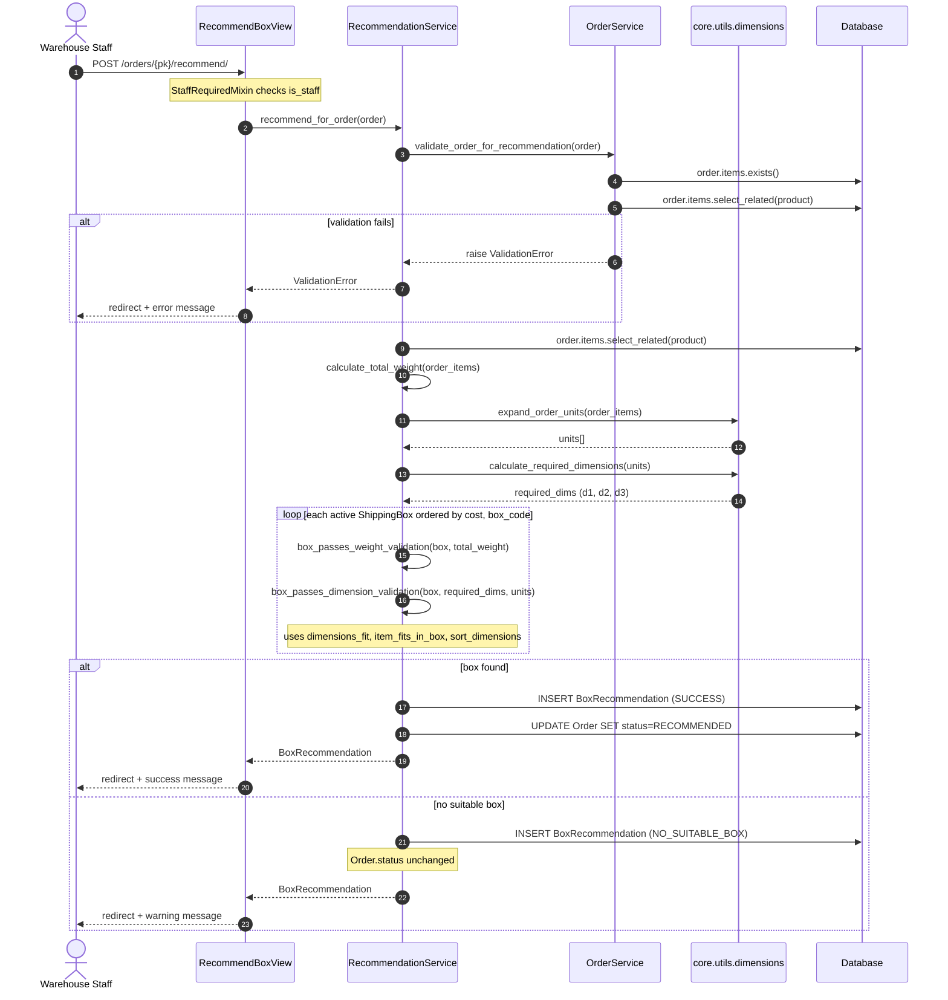
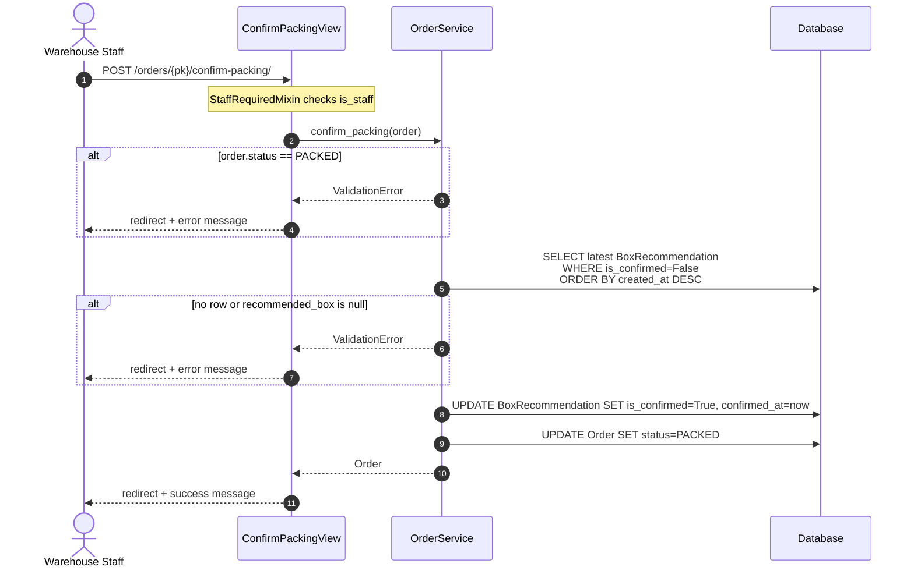
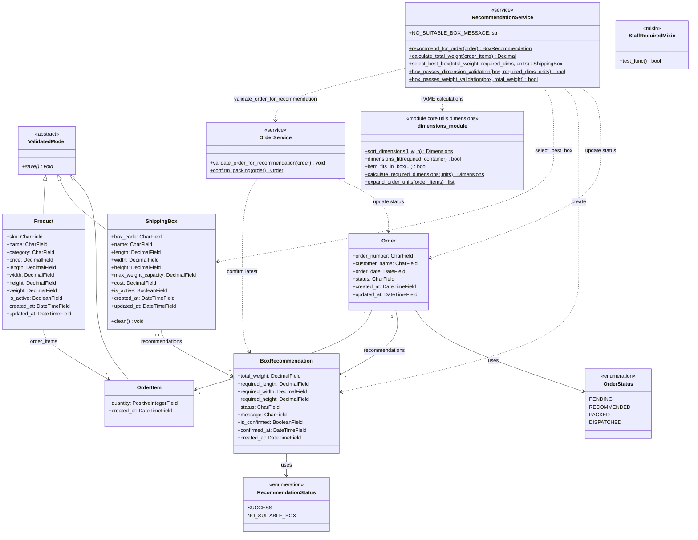
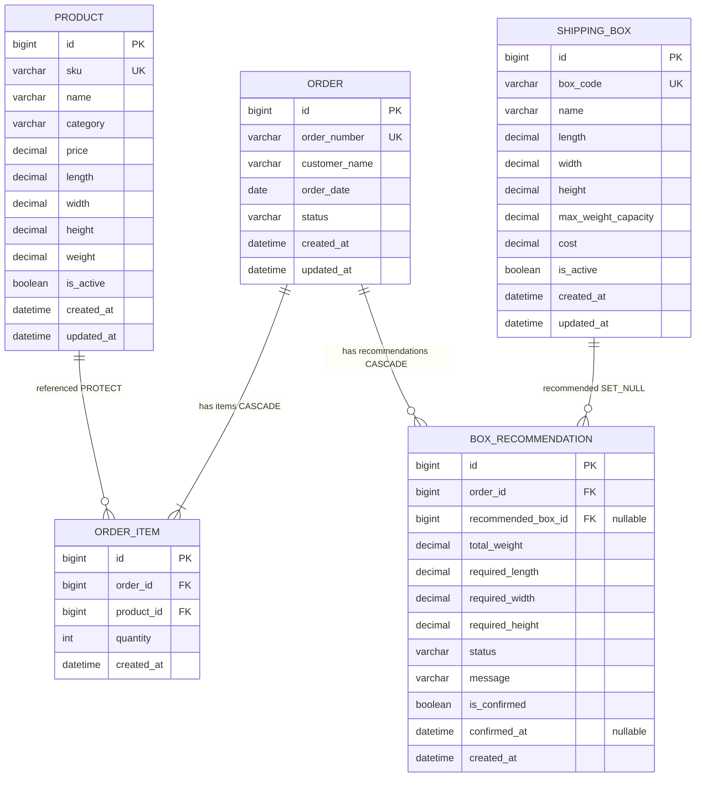
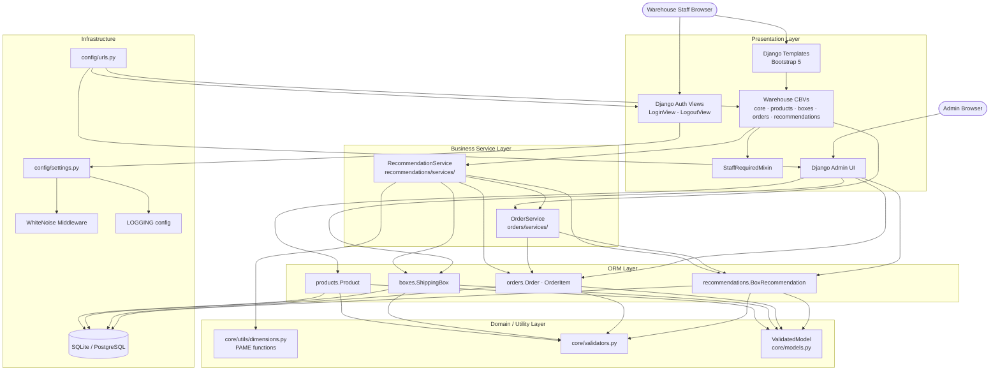
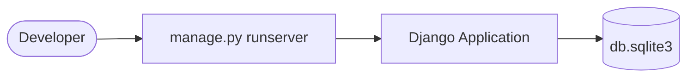
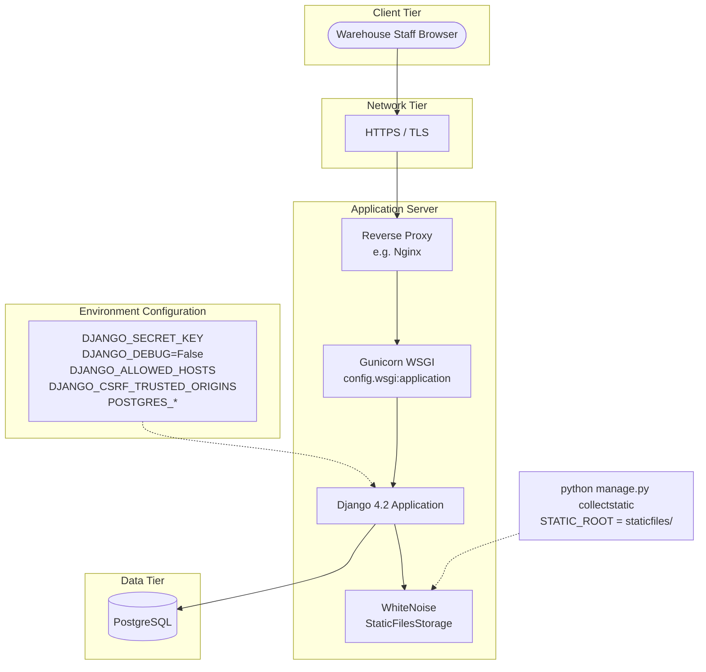

# UML & Architecture Diagrams
## Smart Box Recommendation System — Tradexa Warehouse

All diagrams below are derived **only** from the implemented codebase (`b:\Tradexa`).  
Actors, models, services, views, and workflows not present in code are excluded.

**Legend:** Solid lines = implemented · `DISPATCHED` order status exists in the model but has no service/UI workflow yet.

---

## 1. Use Case Diagram

Implemented actors:
- **Warehouse Staff** — `User` with `is_staff=True`, enforced by `StaffRequiredMixin`
- **Administrator** — Django `User` with admin access at `/admin/`

```mermaid
flowchart TB
    Staff((Warehouse Staff))
    Admin((Administrator))

    subgraph System["Smart Box Recommendation System"]
        direction TB

        subgraph Auth["Authentication"]
            UC_LOGIN[Login]
            UC_LOGOUT[Logout]
        end

        subgraph Browse["Read-Only Warehouse UI"]
            UC_DASH[View Dashboard]
            UC_PLIST[Browse Products]
            UC_PDET[View Product Detail]
            UC_BLIST[Browse Shipping Boxes]
            UC_BDET[View Shipping Box Detail]
            UC_OLIST[Browse Orders]
            UC_ODET[View Order Detail]
            UC_RLIST[Browse Recommendations]
            UC_RDET[View Recommendation Detail]
        end

        subgraph Packing["Packing Workflow"]
            UC_REC[Recommend Box]
            UC_CONF[Confirm Packing]
        end

        subgraph AdminUC["Django Admin /admin/"]
            UC_APROD[Manage Products]
            UC_ABOX[Manage Shipping Boxes]
            UC_AORD[Manage Orders and Order Items]
            UC_AREC[View Box Recommendations]
        end
    end

    Staff --> UC_LOGIN
    Staff --> UC_LOGOUT
    Staff --> UC_DASH
    Staff --> UC_PLIST
    Staff --> UC_PDET
    Staff --> UC_BLIST
    Staff --> UC_BDET
    Staff --> UC_OLIST
    Staff --> UC_ODET
    Staff --> UC_RLIST
    Staff --> UC_RDET
    Staff --> UC_REC
    Staff --> UC_CONF

    Admin --> UC_APROD
    Admin --> UC_ABOX
    Admin --> UC_AORD
    Admin --> UC_AREC

    UC_REC -.->|includes| UC_ODET
    UC_CONF -.->|includes| UC_ODET
```



| Use case | View / Entry point |
|----------|-------------------|
| Login | `LoginView` → `/accounts/login/` |
| Logout | `LogoutView` → `/accounts/logout/` |
| View Dashboard | `DashboardView` → `/` |
| Browse Products | `ProductListView` → `/products/` |
| View Product Detail | `ProductDetailView` → `/products/<pk>/` |
| Browse Shipping Boxes | `ShippingBoxListView` → `/boxes/` |
| View Shipping Box Detail | `ShippingBoxDetailView` → `/boxes/<pk>/` |
| Browse Orders | `OrderListView` → `/orders/` |
| View Order Detail | `OrderDetailView` → `/orders/<pk>/` |
| Recommend Box | `RecommendBoxView` → `POST /orders/<pk>/recommend/` |
| Confirm Packing | `ConfirmPackingView` → `POST /orders/<pk>/confirm-packing/` |
| Browse Recommendations | `RecommendationListView` → `/recommendations/` |
| View Recommendation Detail | `RecommendationDetailView` → `/recommendations/<pk>/` |

---

## 2. Activity Diagram — Recommend Box Workflow

Reflects `RecommendationService.recommend_for_order()` and `OrderService.validate_order_for_recommendation()`.



---

## 3. Activity Diagram — Confirm Packing Workflow

Reflects `OrderService.confirm_packing()`.



---

## 4. Sequence Diagram — Recommend Box (End-to-End)



---

## 5. Sequence Diagram — Confirm Packing



---

## 6. Class Diagram

Shows implemented domain models, abstract base, services, mixin, and PAME utility functions.



### Warehouse view classes (presentation layer)

| Class | Base classes |
|-------|----------------|
| `DashboardView` | `StaffRequiredMixin`, `TemplateView` |
| `ProductListView` | `StaffRequiredMixin`, `ListView` |
| `ProductDetailView` | `StaffRequiredMixin`, `DetailView` |
| `ShippingBoxListView` | `StaffRequiredMixin`, `ListView` |
| `ShippingBoxDetailView` | `StaffRequiredMixin`, `DetailView` |
| `OrderListView` | `StaffRequiredMixin`, `ListView` |
| `OrderDetailView` | `StaffRequiredMixin`, `DetailView` |
| `RecommendBoxView` | `StaffRequiredMixin`, `View` |
| `ConfirmPackingView` | `StaffRequiredMixin`, `View` |
| `RecommendationListView` | `StaffRequiredMixin`, `ListView` |
| `RecommendationDetailView` | `StaffRequiredMixin`, `DetailView` |

---

## 7. ER Diagram

Matches Django models and foreign-key `on_delete` behaviour.



### Constraints (implemented)

| Table | Constraint |
|-------|------------|
| `ORDER_ITEM` | `UNIQUE (order_id, product_id)` — `unique_order_product` |
| `PRODUCT` | `UNIQUE (sku)` |
| `SHIPPING_BOX` | `UNIQUE (box_code)` |
| `ORDER` | `UNIQUE (order_number)` |

---

## 8. Component Diagram



---

## 9. Deployment Diagram

Reflects `config/settings.py`, `config/wsgi.py`, and `requirements.txt` (Django, Gunicorn, WhiteNoise, psycopg2-binary).

### Development deployment



### Production deployment



| Node | Technology (as implemented) |
|------|----------------------------|
| WSGI entry | `config.wsgi.application` |
| App server | Gunicorn (`requirements.txt`) |
| Framework | Django 4.2.30 |
| Static files | `STATIC_ROOT`, WhiteNoise `CompressedManifestStaticFilesStorage` (production) |
| Database (dev) | SQLite `db.sqlite3` |
| Database (prod) | PostgreSQL when `POSTGRES_DB` is set |
| Security (prod) | `SECURE_SSL_REDIRECT`, secure cookies, optional HSTS via env |

---

## 10. Order Status State (Reference)

Implemented transitions only:

```mermaid
stateDiagram-v2
    [*] --> PENDING : Order created

    PENDING --> RECOMMENDED : RecommendationService<br/>successful recommendation
    RECOMMENDED --> PACKED : OrderService.confirm_packing

    PENDING --> PENDING : RecommendationService<br/>NO_SUITABLE_BOX
    RECOMMENDED --> RECOMMENDED : RecommendationService<br/>re-recommend allowed

    PACKED --> PACKED : confirm_packing blocked
    PACKED --> PACKED : recommend blocked

    note right of DISPATCHED
        DISPATCHED exists in OrderStatus
        but no implemented transition
    end note
```

---

## Source file index

| Diagram area | Primary source files |
|--------------|---------------------|
| Models / ER | `products/models.py`, `boxes/models.py`, `orders/models.py`, `recommendations/models.py` |
| Services | `orders/services/order_service.py`, `recommendations/services/recommendation_service.py` |
| PAME | `core/utils/dimensions.py` |
| Views / use cases | `*/views.py`, `config/urls.py`, `*/urls.py` |
| Auth | `core/mixins.py`, `config/urls.py` |
| Deployment | `config/settings.py`, `config/wsgi.py`, `requirements.txt` |

---

*Generated from finalized implementation. Suitable for internship / academic submission alongside `docs/ARCHITECTURE.md`.*
